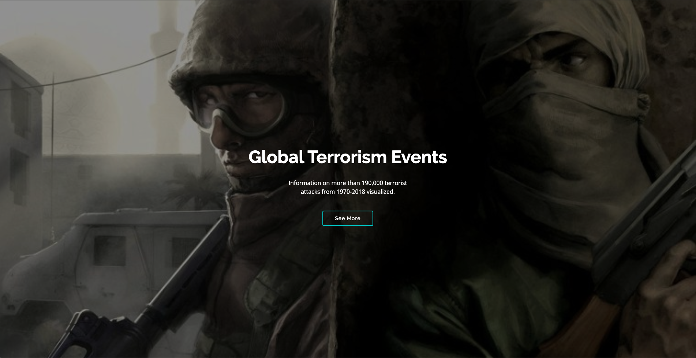
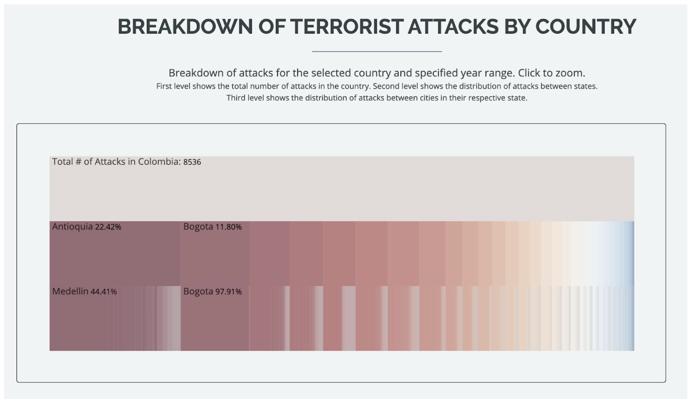

# project_terrorism

#### Install http-server if you do not have it
```npm install http-server -g```

#### To run a local webserver at port 9000
```http-server . -p 9000```

***
## Milestone 2 Write-up
Our web application is to conduct an analysis of terrorist attacks that happened from 1971 to 2018 around the world in order to attract more public attention to the potential hazards around the world. 

**Data Abstraction**  
We used a table dataset from [Global Terrorism Database](https://gtd.terrorismdata.com/) which contains approximately 190,000 items and trimmed the dataset down to 17 attributes that are of use to us. The attributes include country_text, country_id, year, month, day, region, province, city, weapon type, etc. Each item represents an attack that happened in the past years around the world with their locations, date, related weapon types. There are 205 countries, 2778 provinces and 39620 cities in this dataset. The cardinality is less than a dozen of the weapon types. The date starts from 1971-01-01 to 2018-12-31. 

**Task Abstraction**  
The goal of our visualization is to discover regions in the world that have a high terrorist attack threat level. To discover regions suspectible to terrorist attacks, we summed up the total number of attacks that happened in each country within the chosen year range. A symbol map was chosen for this because it allows users to quickly discover problematic areas by looking at the size of the circle. A year range slider is implemented for users to select any year range between 1970 and 2018. In order to provide even more detail on region, we linked the symbol map to an icicle plot. The icicle plot will show a country's distribution of attacks across all the different states and cities. Lastly, our secondary goal was to let users compare the number of attacks between years and to see the overall trend. Our innovative view accomplishes this by showing the distrubtion of total attacks globally per year. Custom glyphs are used to mark the number of different attack types that terrorist use.

**Changes Made Since Proposal**
* Symbol Map (View 1)    
    * Our view 1 involves rendering the countries of a world map by the number of attacks that occur in the corresponding country. Originally, we thought we would do a Choropleth Map. The TAs kindly reminded us that Choropleth Map is only good for the rendering of proportional and not absolute values. Henceforth, we chose to work on a symbol map.      

    * However, there are some issues that we are noticing with the Symbol Map. Firstly, the circles of a symbol map, on occasions, overlap or overlap each other. This makes it tricky to differentiate the number of attacks of one country from another. In addition, some countries have a very small amount of attacks and are henceforth, represented by mini-scale circles which are almost impossible to discover. This indicates that there is no terrorism within the country which is inaccurate and even deceptive.    
    * In order to fix this issue, we are thinking of either adding a tooltip or switching to proportional values and then representing the data through a Choropleth Map. 
    * The actual data for the number of attacks is derived from the terrorism dataset. However, the centroid data is gathered from another dataset. There are some instances where the data doesn’t match. There are some countries which do not exist anymore. For instance, West Germany doesn’t exist anymore. Other names of other countries are represented differently. For example, the United States of America may also be represented by the abbreviation U.S.A. We are curious about how we should handle such edge cases.     
    * The year slider appears to have some latency. We believe this primary suspect is the processData() method within the symbolMap class.     

* Icicle Plot (View 2)
    * Changed pie chart into icicle plot to represent the percentage of attacks. Since the pie chart is not an effective visual encoding to contain the attributes of province and city, which have more than 50 provinces that exceed the pie chart’s scalability. We changed it to a horizontal icicle plot which has a larger capacity and more effective visual encoding which can meet our project requirements that encode the percentage of attacks in the cities and provinces of the selected country.
          
* Innovative View (View 3)
    * We split the view 3 into 4 separate graphs that users can toggle between them and the year range from 1971 to 2018 is split into 4 equal ranges in order. We need to have similar y-values so that the lines were long enough to fit the custom glyphs in. We still keep an overall bar chart of the whole year range for users to compare the number of attacks across all the years.    
    * We also combined some attack types. Because the attack numbers related to them were too small to illustrate especially with a custom glyph in the chart.    

**Data Processing**     
No data pipeline process, just an initial manual deletion of unneeded columns in the csv. On the fly data processing done with D3 and JavaScript Array Functions. d3.nest was applied to implement a nested structure and roll up the attacks to count the number of attacks. After that, d3.hierarchy was applied to make the processed data into 3 levels (the attacks happened in the chosen country, the attacks happened in each province of the country, the attacks happened in the cities of each province). 

**Project Management & Team Assessment**
* Status Update (Original Estimate in Square Brackets)             
    * Mar 16 [~5 Hours] - Prune Data and Pre-Process Data If Needed - *Actual 2 Hours*
    * Mar 18 [~ 3 Hours] - Plan the web design that consists of these 3 views -  *Actual 15 Hours - Began implementation too*
    * Mar 20 [~12 Hours] - Complete Static Version of View 1 - *Actual 12 Hours*
    * Mar 20 [~15 Hours] - Complete Static Version of View 2 - *Actual 12 Hours*
    * Mar 20 [~10 Hours] - Complete Rudimentary Version of View 3 (No Custom Glyphs/Tooltips/Selection/Sorting) - *Actual 12 Hours*
    * Mar 25 [~10 Hours] - Implement UI widgets and able to filter data for View 1 - *Actual 4 Hours*
    * Mar 25 [~6 Hours] - Link View 1 and View 2 - *Actual 2 Hours*
    * Mar 28 - Milestone 2 Write-up *Actual 5 Hours*

    TODO
    * Apr 5 [~10 Hours] - Implement interactive features for View 3 (Selection/Tooltips/Sort)
    * Apr 5 [~5 Hours] - Finish View 2 by making it zoomable and better styling and color
    * Apr 5 [~10 Hours] - Finish the web app design
    * Apr 10 [~15 Hours] - Make last refinements and styling changes
    
* Contribution Breakdown     
    * Siddhartha Gupta is working on View 1. Kate Yang is working on View 2. She also linked View 1 with View 2. Kenny is working on View 3 and created main web page.

* Team Breakdown
    * 

**Prototype Screenshots**
* 
* 
* 
* 
* 
