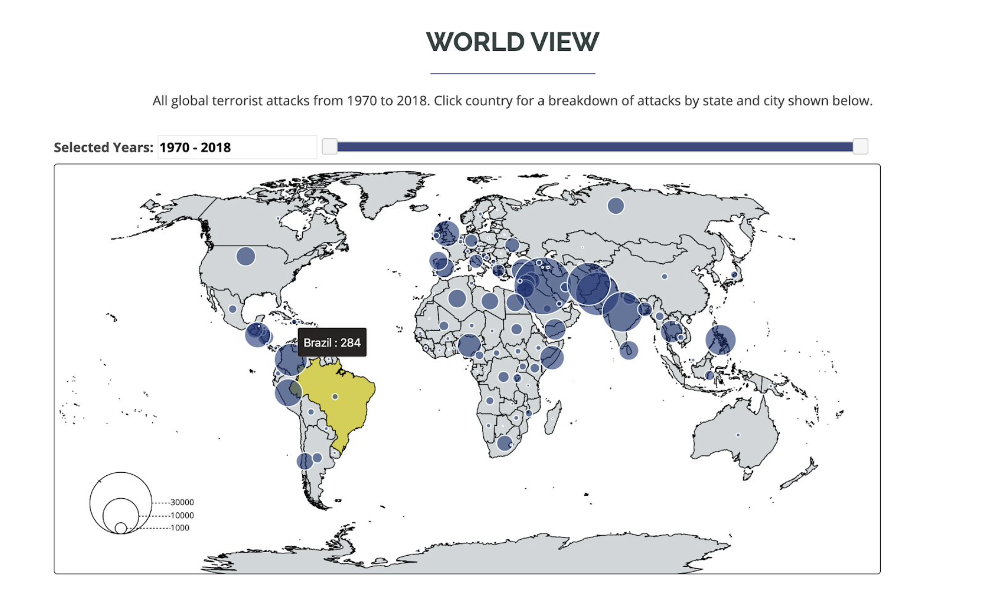
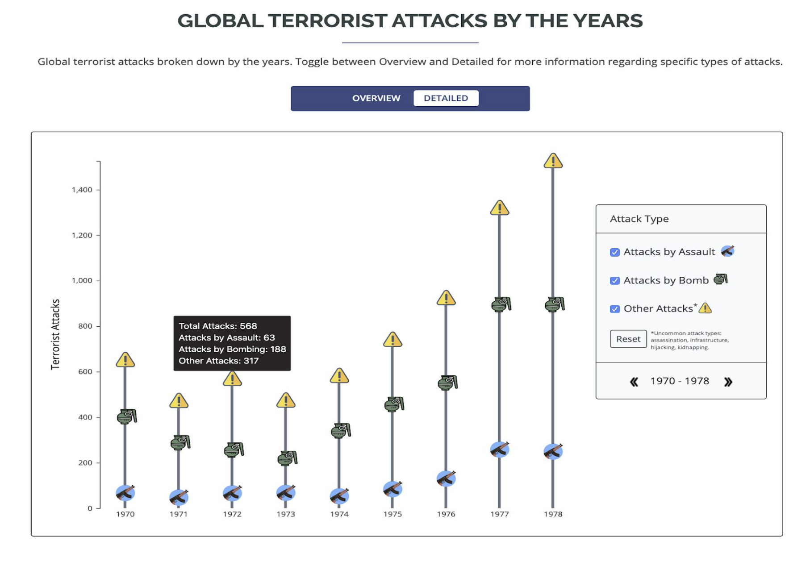

# project_terrorism

### Install http-server if you do not have it
```npm install http-server -g```

### To run a local webserver at port 9000
```http-server . -p 9000```

***
# About
This visualization project conducts an analysis of terrorist attacks that happened from 1971 to 2018 around the world in order to attract more public attention to the potential hazards around the world. 

### Data Abstraction
We used a table dataset from [Global Terrorism Database](https://gtd.terrorismdata.com/) which contains approximately 190,000 items and trimmed the dataset down to 17 attributes that are of use to us. The attributes include country_text, country_id, year, month, day, region, province, city, weapon type, etc. Each item represents an attack that happened in the past years around the world with their locations, date, related weapon types. There are 205 countries, 2778 provinces and 39620 cities in this dataset. The cardinality is less than a dozen of the weapon types. The date starts from 1971-01-01 to 2018-12-31. 

### Task Abstraction
The goal of our visualization is to discover regions in the world that have a high terrorist attack threat level. To discover regions suspectible to terrorist attacks, we summed up the total number of attacks that happened in each country within the chosen year range. A symbol map was chosen for this because it allows users to quickly discover problematic areas by looking at the size of the circle. A year range slider is implemented for users to select any year range between 1970 and 2018. In order to provide even more detail on region, we linked the symbol map to an icicle plot. The icicle plot will show a country's distribution of attacks across all the different states and cities. Lastly, our secondary goal was to let users compare the number of attacks between years and to see the overall trend. Our innovative view accomplishes this by showing the distrubtion of total attacks globally per year. Custom glyphs are used to mark the number of different attack types that terrorist use.

### Visualization
**Symbol Map (View 1)**
<p>
    The goal of View 1 is to allow users to identify countries in the world that are hot spots for terrorist attacks. All ~190,000 terrorist attacks throughout 1970 to 2018 are displayed initially and the data is aggregated by country. To allow for more flexibility, we gave users the option to filter the attacks by any year range within 1970 to 2018 by using a double-ended slider. Hovering over a country will display a tooltip showing the corresponding country’s name and number of attacks in that year range. Furthermore, a click on a country in View 1 will trigger an update to View 2. The selected country will be shown in View 2 breaking down the number of attacks in that country by the states and cities.
    
   Given that our goal is to identify countries prone to terrorist attacks and our dataset contained geographical information, a map was naturally chosen. Originally, we were planning to use a choropleth map but decided not to because they can be misleading due to the “Lie Factor.” So, we settled on using a symbol map as the symbol can represent our aggregated data and allowed us to keep our original spatial geometry of the world. The area of each circle is proportional to the number of terrorist attacks in that country for the selected year range. We chose to use yellow for selecting a country and blue for our symbol because they’re less likely to be affected by colour-blindedness.



**Icicle Plot (View 2)**
<p>
    To provide even more detail on hot spots for terrorist attacks, we wanted to break down a country’s attacks by state and city. As previously mentioned, the icicle plot can be updated by selecting a country in the symbol map. Since within a country, there are many states and even more cities, some of the rectangles in the plot are quite small. Therefore, we made the icicle plot zoomable so that users can still look at the less common cities/states if they wished. Clicking on a rectangle will automatically zoom it into focus so users can see the name of the city/state and the percentage of attacks that occured in the city/state.
   
   The reason we chose to use an icicle plot is that our breakdown of a country (country > state > city) is hierarchical in nature. This made the icicle plot an appealing choice. Furthermore, with an icicle plot, the large rectangles automatically draw the user’s attention which is what we want. We want users to be able to quickly identify high-risk states and cities within a country. An icicle plot can support dozens to hundreds of marks which is sufficient for our needs.
          


**Innovative View (View 3)**
<p>
    The purpose of View 3 is allow users to compare the number of terrorist attacks between years and identify trends. Users can toggle between an ‘Overview’ bar chart and ‘Detailed’ innovative bar chart variation. Tooltips are enabled on hover for both charts. On the ‘Detailed’ chart, we break down the types of attacks in each year by categorizing them into attacks by assault, bombing or other. Users can interact with our innovative view by selecting or deselecting the different attack categories. E.g. If a user is only interested in attacks by bombing then they could deselect the other categories.
   
   We chose to use a bar chart for our overview chart because a bar chart is perfect for a few dozen items and is easy to compare and lookup values. For our innovative detailed chart, we used custom glyphs to make the visualization more attractive. Since only the first attack type is aligned on a horizontal scale, we made 2 adjustments so it is easier to compare the other 2 attack types across the years. First, we enabled a tooltip that displays the exact number of different attacks per year so users can just read off those numbers. Second, we created a selection window, where users select or deselect different attack categories. Users can then just select 1 attack type if they were interested in comparing the values across the years.




